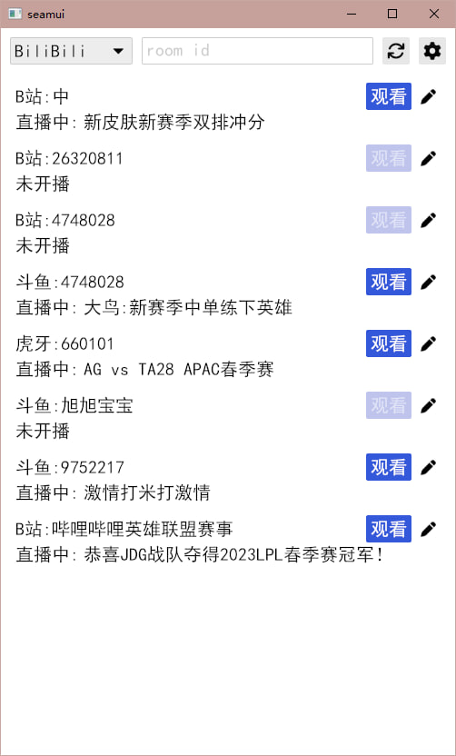
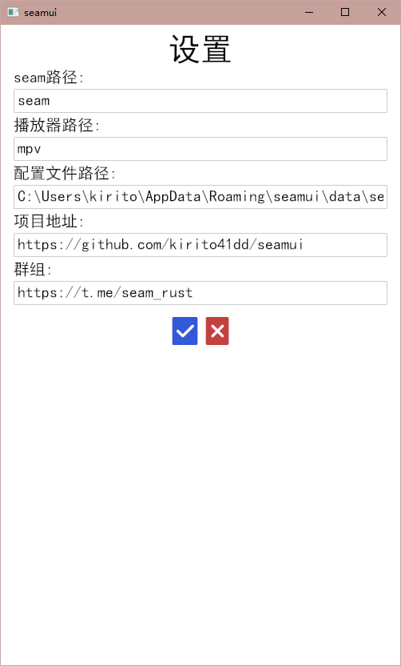

# seamui
基于[seam](https://github.com/Borber/seam)开发的直播观看助手，收集不同平台的主播，并用本地播放器观看直播

目前实现了粗糙的原型，可用状态

## 截图

|||
|-|-|
|||

## 使用

需要先安装[seam](https://github.com/Borber/seam)和[mpv](https://mpv.io/installation/)播放器，也支持其它播放器如potplayer

然后直接下载本程序二进制运行即可，也可以自行编译

默认配置seam路径为`seam`，播放器路径为`mpv`，可以通过配置文件更改

配置文件所在目录：
* win：`C:\Users\xxx\AppData\Roaming\seamui\data`
* linux：`~/.local/share/seamui`
* mac：`~/Library/Application Support/seamui`

需要日志打印增加环境变量即可: `RUST_LOG=seamui=info seamui.exe`